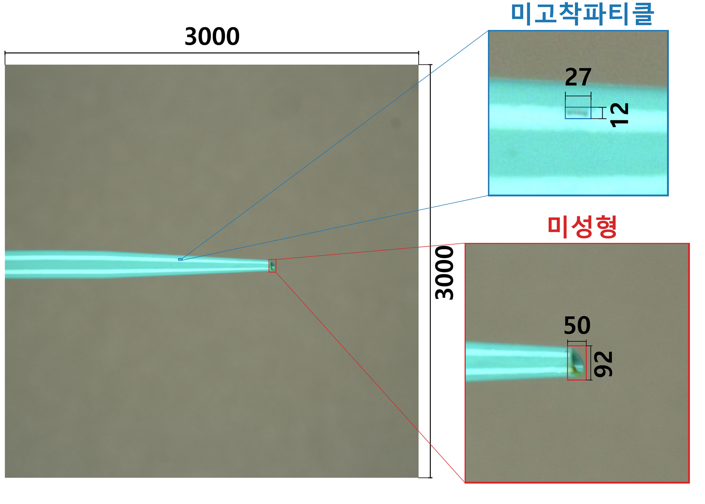
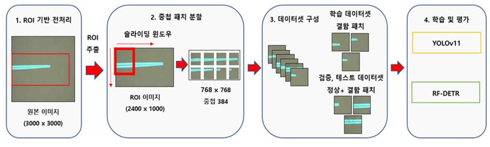
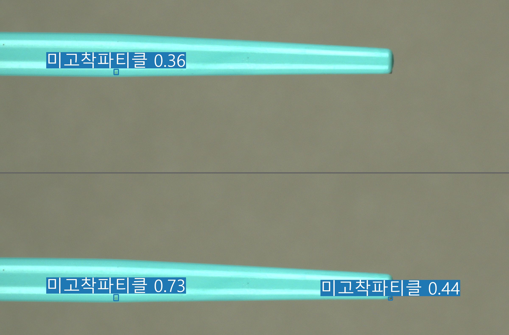

# Dilator Tip Defect Detection

Research codebase for detecting tiny irregular defects in high-resolution dilator tip inspection images.

This repository provides the implementation of a data-centric object detection pipeline for medical device manufacturing inspection. The pipeline improves small defect detection by applying dilator tip ROI extraction and overlapping patch generation before training object detection models.

The repository includes preprocessing scripts, YOLO-format and COCO-format dataset conversion tools, YOLOv11 and RF-DETR training scripts, visualization utilities, and experimental result summaries.

## Paper Information

* **Title**: Object Detection Based Tiny Irregular Defect Detection in High-Resolution Dilator Tip Images
* **Korean Title**: 고해상도 Dilator Tip 이미지에서의 객체 검출 기반 미세 비정형 결함 검출
* **Paper Type**: Undergraduate poster paper
* **Task**: Tiny irregular defect detection in high-resolution dilator tip inspection images
* **Models**: YOLOv11, RF-DETR
* **Keywords**: Industrial Inspection, Medical Device Manufacturing, Catheter, YOLO, DETR

## Overview

High-resolution dilator tip inspection images contain very small defect regions compared with the full image area. In this project, target defects occupy only a small fraction of the original 3000 × 3000 image. This creates a severe foreground-background imbalance and makes direct object detection difficult.

To address this issue, the pipeline applies:

1. Dilator tip ROI extraction
2. Overlapping patch generation
3. YOLO-format dataset construction
4. YOLOv11 training
5. YOLO-to-COCO conversion
6. RF-DETR training
7. Quantitative and qualitative performance comparison

The main goal is to evaluate whether object detection models can effectively detect tiny and irregular defects in high-resolution medical device manufacturing images.

## Figures

### Figure 1. Defect Examples

Figure 1 shows a full high-resolution dilator tip inspection image and enlarged examples of representative target defects, including adhered particle and short-shot defects.



### Figure 2. Overall Pipeline

Figure 2 illustrates the overall pipeline of the proposed defect detection framework. The pipeline consists of ROI-based preprocessing, overlapping patch generation, dataset construction, and model training/evaluation using YOLOv11 and RF-DETR.



### Figure 3. Detection Results Before and After Preprocessing

Figure 3 compares qualitative detection results before and after applying the proposed preprocessing strategy. After ROI extraction and overlapping patch-based preprocessing, small defect regions are detected more clearly.



## Method Overview

The proposed pipeline is designed for high-resolution inspection images where defects are extremely small compared with the background.

### 1. ROI Extraction

The original image contains a large background area. ROI extraction removes unnecessary background regions and keeps the dilator tip inspection region.

### 2. Overlapping Patch Generation

The ROI image is split into overlapping patches. This prevents information loss when a defect appears near a patch boundary and increases the relative size of small defects.

### 3. Dataset Construction

For training, patches containing defects are used to focus learning on positive samples. For validation and testing, all patches are used to reflect realistic evaluation conditions.

### 4. Model Training and Evaluation

YOLOv11 and RF-DETR are trained and evaluated under the same dataset split. The models are compared using:

* mAP50
* mAP50:95
* Precision
* Recall

## Repository Structure

```text
dilator-tip-defect-detection/
├── configs/
│   ├── dataset/
│   │   └── dilator_tip.yaml
│   ├── yolo/
│   │   └── yolo11_dilator.yaml
│   └── rfdetr/
│       └── rfdetr_dilator.yaml
│
├── src/
│   └── dilator_tip_detection/
│       ├── preprocessing/
│       │   ├── crop_roi.py
│       │   ├── split_raw_dataset.py
│       │   ├── split_patch_yolo.py
│       │   └── split_sliding_window_yolo.py
│       │
│       ├── converters/
│       │   ├── raw_to_yolo.py
│       │   └── yolo_to_coco.py
│       │
│       ├── train/
│       │   ├── train_yolo.py
│       │   └── train_rfdetr.py
│       │
│       ├── analysis/
│       │   ├── dilator_eda.py
│       │   ├── patch_eda.py
│       │   └── object_size_statistics.py
│       │
│       ├── visualization/
│       │   ├── visualize_gt.py
│       │   └── visualize_gt_paper_style.py
│       │
│       └── figures/
│           ├── make_figure1_pipeline.py
│           └── make_figure3_results.py
│
├── assets/
│   ├── figure1_defect_examples.png
│   ├── figure2_pipeline.png
│   └── figure3_detection_results.png
│
├── data/
│   └── README.md
├── weights/
│   └── README.md
├── requirements.txt
└── README.md
```

## Environment Setup

Create and activate a Python environment.

```bash
conda create -n dilator python=3.10
conda activate dilator
```

Install dependencies.

```bash
pip install -r requirements.txt
```

For YOLOv11 training, install Ultralytics if it is not already installed.

```bash
pip install ultralytics
```

RF-DETR requires its own package and pretrained weight file. Model weights are not included in this repository.

## Dataset and Weight Policy

This repository does not include:

* Raw inspection images
* YOLO datasets
* COCO datasets
* Private label files
* Model weights
* Training outputs
* Visualization outputs

Expected local dataset structure:

```text
data/
├── raw/
├── intermediate/
└── processed/
```

Model weights should be placed locally under `weights/` if needed.

```text
weights/
├── yolo11s.pt
└── rf-detr-small.pth
```

The `weights/` directory is ignored by Git.

## Usage

Set `PYTHONPATH` before running modules from the repository root.

### Windows CMD

```cmd
set PYTHONPATH=%CD%\src
```

### Linux / macOS

```bash
export PYTHONPATH=$PWD/src
```

## 1. ROI Crop for YOLO Dataset

This script crops the dilator tip ROI and converts YOLO labels into ROI-local coordinates.

```cmd
python -m dilator_tip_detection.preprocessing.crop_roi ^
  --src-root "C:\path\to\source_yolo_dataset" ^
  --dst-root "C:\path\to\roi_cropped_yolo_dataset" ^
  --splits train valid test ^
  --roi 0 1000 2400 2000 ^
  --class-names impurity short_shot
```

Expected output:

```text
roi_cropped_yolo_dataset/
├── train/
├── valid/
├── test/
└── data.yaml
```

## 2. Dataset EDA

Run dataset-level integrity checks and class distribution analysis.

```cmd
python -m dilator_tip_detection.analysis.dilator_eda ^
  --dataset-root "C:\path\to\roi_cropped_yolo_dataset" ^
  --splits train valid test ^
  --class-names 0=impurity 1=short_shot
```

This reports:

* Number of images
* Normal / defect image counts
* Missing label files
* Empty label files
* Invalid label lines
* Orphan label files
* Class-wise annotation counts

## 3. YOLO to COCO Conversion

Convert YOLO-format labels into COCO format for RF-DETR.

```cmd
python -m dilator_tip_detection.converters.yolo_to_coco ^
  --src-root "C:\path\to\roi_cropped_yolo_dataset" ^
  --dst-root "C:\path\to\rfdetr_coco_dataset" ^
  --splits train valid test ^
  --class-names impurity short_shot
```

Expected output:

```text
rfdetr_coco_dataset/
├── train/
├── valid/
└── test/
```

## 4. Ground-Truth Visualization

Generate ground-truth visualization images.

```cmd
python -m dilator_tip_detection.visualization.visualize_gt ^
  --base-dir "C:\path\to\roi_cropped_yolo_dataset" ^
  --out-dir "C:\path\to\gt_visualization" ^
  --splits test ^
  --class-names 0=impurity 1=short_shot ^
  --include-empty
```

## 5. YOLOv11 Training

Run YOLOv11 training.

```cmd
python -m dilator_tip_detection.train.train_yolo ^
  --data "C:\path\to\roi_cropped_yolo_dataset\data.yaml" ^
  --weights "weights\yolo11s.pt" ^
  --project "C:\path\to\yolo_runs" ^
  --name "yolo11s_dilator" ^
  --epochs 100 ^
  --imgsz 768 ^
  --batch 16 ^
  --device 0 ^
  --workers 4 ^
  --patience 30
```

For a quick smoke test:

```cmd
python -m dilator_tip_detection.train.train_yolo ^
  --data "C:\path\to\roi_cropped_yolo_dataset\data.yaml" ^
  --weights "weights\yolo11s.pt" ^
  --project "C:\path\to\yolo_runs" ^
  --name "smoke_yolo_roi" ^
  --epochs 1 ^
  --imgsz 640 ^
  --batch 4 ^
  --device 0 ^
  --workers 0 ^
  --patience 1
```

## 6. RF-DETR Training

Run RF-DETR training on the COCO-format dataset.

```cmd
python -m dilator_tip_detection.train.train_rfdetr ^
  --dataset-dir "C:\path\to\rfdetr_coco_dataset" ^
  --pretrain-weights "weights\rf-detr-small.pth" ^
  --output-dir "C:\path\to\rfdetr_runs" ^
  --num-classes 2 ^
  --epochs 100 ^
  --batch-size 4 ^
  --grad-accum-steps 1 ^
  --lr 0.0001 ^
  --resolution 768 ^
  --early-stopping-patience 30
```

On Windows, if OpenMP-related runtime conflicts occur, add:

```cmd
--allow-kmp-duplicate
```

## Main Results

| Model   | Preprocessing | mAP50 (%) | mAP50:95 (%) | Precision (%) | Recall (%) |
| ------- | ------------- | --------: | -----------: | ------------: | ---------: |
| YOLOv11 | Before        |      65.8 |         31.1 |          74.5 |       62.1 |
| YOLOv11 | After         |      73.9 |         36.4 |          74.1 |       69.8 |
| RF-DETR | Before        |      70.6 |         35.8 |          82.2 |       67.6 |
| RF-DETR | After         |      74.3 |         37.8 |          78.0 |       74.3 |

The proposed preprocessing strategy improved mAP50 by 8.1 percentage points for YOLOv11 and 3.7 percentage points for RF-DETR. Recall also increased by more than 6 percentage points for both models.

## Class-wise Performance

| Defect Type      | Model   | mAP50 (%) | mAP50:95 (%) | Precision (%) | Recall (%) |
| ---------------- | ------- | --------: | -----------: | ------------: | ---------: |
| Adhered Particle | YOLOv11 |      61.8 |         30.7 |          66.3 |       57.2 |
| Adhered Particle | RF-DETR |      69.5 |         34.0 |          75.8 |       66.1 |
| Short Shot       | YOLOv11 |      86.1 |         42.1 |          82.0 |       82.3 |
| Short Shot       | RF-DETR |      79.0 |         41.7 |          80.2 |       82.3 |

RF-DETR showed stronger performance on adhered particle defects, which have irregular shapes and large size variation. YOLOv11 showed stronger performance on short-shot defects, which have clearer local shape changes.

## Preprocessing Validation Summary

### ROI Crop

* Total images: 376
* Failed images: 0
* Input boxes: 715
* Output boxes: 715

### Dataset EDA

* Total images: 376
* Normal images: 17
* Defect images: 359
* Missing label images: 0
* Invalid label lines: 0
* Orphan txt files: 0

### Class Counts

* impurity: 545
* short_shot: 170

### YOLO-to-COCO Conversion

* Train: 214 images / 425 annotations
* Valid: 121 images / 208 annotations
* Test: 41 images / 82 annotations

## Notes

This repository is intended for research-code organization and reproducibility.

Dataset and model weight files must be prepared separately.

Generated outputs should be saved outside this repository or under ignored directories.

Official results should be reproduced with the full training schedule and original experimental configuration.

## Citation

```bibtex
@inproceedings{park2026dilator,
  title={Object Detection Based Tiny Irregular Defect Detection in High-Resolution Dilator Tip Images},
  author={SANG JUN Park and JAE YEONG Min and YEJIN Kim and JUN-SEOK Yun and MIN SU Kim and JONG PIL Yun},
  year={2026},
  note={Undergraduate poster paper}
}
```

## License

This repository is currently maintained for research purposes. A formal license can be added after confirming data and model release conditions.


